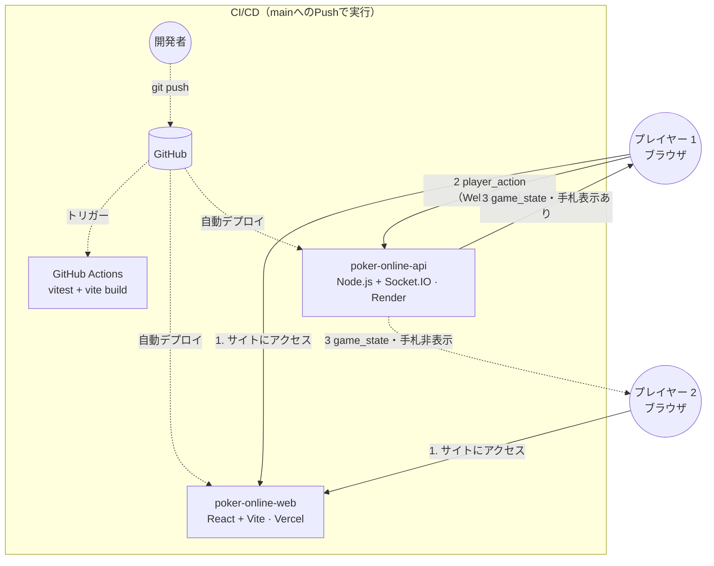

# Poker Online

*他の言語で読む: [English](README.md), [日本語](README.ja.md)*

リアルタイムマルチプレイヤー テキサスホールデムポーカー — ブラウザ完結、仮想チップのみ。

**[ライブデモ](https://poker-online-three.vercel.app/)**

[](https://github.com/haku3782/poker-online/actions/workflows/ci.yml)

---

## 技術スタック

| レイヤー | 技術 |
|---|---|
| API | Node.js、TypeScript、Express 5、Socket.IO 4 |
| Web | React 19、TypeScript、Vite 8、Socket.IO client |
| テスト | Vitest — 39ユニットテスト |
| CI | GitHub Actions |
| デプロイ | Render（API）+ Vercel（Web）|

---

## システムアーキテクチャ



---

## バックエンドの特徴

### サーバー権威型ゲーム状態
ゲーム状態はすべてサーバーが管理します。`game_state` ブロードキャスト時、ホールカードは所有ソケット宛のペイロードにのみ含め、他プレイヤーへは省略したオブジェクトを送信します。クライアントへの信頼は一切ありません。

### ハンド評価器（`handEvaluator.ts`）
- 7枚からの C(7,5) = 21通りの5枚組み合わせをすべて評価
- ハイカード〜ストレートフラッシュの9カテゴリ完全対応
- ホイールストレート（A-2-3-4-5 = 5ハイ、Aは14でなく1扱い）の正確な検出
- タイブレーカー：枚数降順・ランク降順の `ranks[]` 辞書比較

### ゲームエンジン（`gameEngine.ts`）
- プリフロップ→フロップ→ターン→リバー→ショーダウンの完全なベッティングラウンドライフサイクル
- ヘッズアップ例外：ディーラーがスモールブラインドをポスト（ポーカー標準ルール）
- レイズ後の再アクション開放：レイズが発生した場合、すでにコールしていたプレイヤーも `playersToAct` に再追加
- オートランアウト：アクション可能なプレイヤーが1人以下（全員オールインまたはフォールド）になった場合、コミュニティカードをショーダウンまで自動配布
- ディーラーローテーション：初期値 `-1` で `indexAfter(n, -1) = 0` となり、初回ハンドの特殊処理が不要

### サイドポットアルゴリズム（`sidePots.ts`）
複数プレイヤーのオールイン状況を正確に処理：
1. 全プレイヤーの `totalContributed` から重複を除いたしきい値を昇順で収集
2. 各レベル: `amount = レイヤーサイズ × (そのレベル以上コントリビュートしたプレイヤー数)`
3. 対象者：そのコントリビューターのうちフォールドしていないプレイヤー
4. 分割ポットの端数チップは席順最初の勝者へ

### 切断・タイムアウトハンドリング（`socketHandlers.ts`）
- **ゲーム中の切断**：`forfeitPlayer()` がターン順に関係なくそのプレイヤーをフォールドさせた後、退室処理。残りプレイヤーのハンドはそのまま継続
- **30秒ターンタイマー**：ルームごとにサーバー側 `setTimeout` を管理し、アクションのたびにリセット。タイムアウト時は自動フォールドを実行

---

## プロジェクト構成

```
poker-online/
├── poker-online-api/          # Node.js + Socket.IO サーバー
│   └── src/
│       ├── index.ts           # HTTP + Socket.IO サーバー起動
│       ├── socketHandlers.ts  # イベントハンドラ・タイマー管理
│       └── game/
│           ├── card.ts        # カード型・デッキ生成・シャッフル
│           ├── handEvaluator.ts
│           ├── player.ts
│           ├── room.ts        # Room と RoomManager
│           ├── sidePots.ts
│           └── gameEngine.ts  # startHand / applyAction / forfeitPlayer
├── poker-online-web/          # React + Vite SPA
│   └── src/
│       ├── types.ts           # 共通型定義（GameState、Card など）
│       ├── socket.ts          # Socket.IO クライアントシングルトン
│       ├── App.tsx            # ロビー ↔ テーブル 画面切り替え
│       └── views/
│           ├── LobbyView.tsx
│           └── TableView.tsx
├── .github/workflows/ci.yml
├── render.yaml
└── vercel.json
```

---

## Socket.IO イベント API

| 方向 | イベント | ペイロード |
|---|---|---|
| クライアント → サーバー | `create_room` | `{ maxSeats?, smallBlind?, bigBlind? }` |
| クライアント → サーバー | `join_room` | `{ roomId, playerName, startingChips? }` |
| クライアント → サーバー | `leave_room` | — |
| クライアント → サーバー | `start_game` | — |
| クライアント → サーバー | `player_action` | `{ type: fold\|check\|call\|raise\|allin, amount? }` |
| クライアント → サーバー | `list_rooms` | — |
| サーバー → クライアント | `room_created` | `{ roomId, maxSeats, smallBlind, bigBlind }` |
| サーバー → クライアント | `room_joined` | `{ roomId, playerId, seat }` |
| サーバー → クライアント | `game_state` | パーソナライズ済み |
| サーバー → クライアント | `rooms_list` | `RoomSummary[]` |
| サーバー → クライアント | `error` | `{ message }` |

---

## テストカバレッジ

```
 Test Files  4 passed (4)
      Tests  39 passed (39)
```

| ファイル | テスト内容 |
|---|---|
| `card.test.ts` | デッキ枚数・一意性・シャッフル |
| `handEvaluator.test.ts` | 9カテゴリ全種・ホイール・タイブレーカー |
| `sidePots.test.ts` | 均等スタック・ショートスタックオールイン・フォールドプレイヤー |
| `gameEngine.test.ts` | ブラインドポスト・ディーラーローテーション・各アクション・サイドポット保全 |
