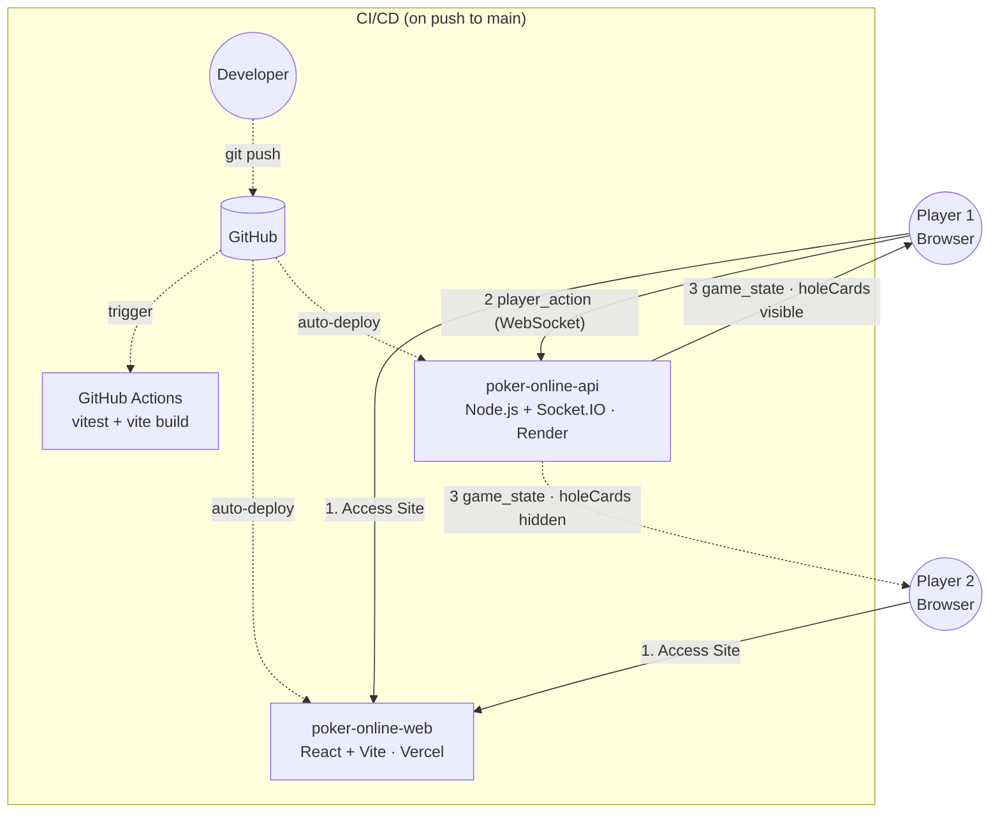

# Poker Online

*Read this in other languages: [English](README.md), [日本語](README.ja.md)*

Real-time multiplayer Texas Hold'em poker — browser-based, virtual chips only.

**[Live Demo](https://poker-online-three.vercel.app/)**

[](https://github.com/haku3782/poker-online/actions/workflows/ci.yml)

---

## Tech Stack

| Layer | Technology |
|---|---|
| API | Node.js, TypeScript, Express 5, Socket.IO 4 |
| Web | React 19, TypeScript, Vite 8, Socket.IO client |
| Test | Vitest — 39 unit tests |
| CI | GitHub Actions |
| Deploy | Render (API) + Vercel (Web) |

---

## System Architecture



---

## Backend Highlights

### Server-Authoritative Game State
The server owns all game state. On each `game_state` broadcast, hole cards are included only in the payload sent to the owning socket — other players receive the same object with that field omitted. There is no client-side trust.

### Hand Evaluator (`handEvaluator.ts`)
- Evaluates all C(7,5) = 21 five-card combinations from a 7-card set
- Covers all 9 hand categories: High Card → Straight Flush
- Correct wheel straight detection (A-2-3-4-5 = 5-high, not 14-high)
- Lexicographic tiebreaker on `ranks[]` with counts-then-rank ordering

### Game Engine (`gameEngine.ts`)
- Full betting round lifecycle: preflop → flop → turn → river → showdown
- Heads-up exception: dealer posts small blind (standard rule)
- Raise reopening: when a raise occurs, all players who already called are re-added to `playersToAct`
- Auto-run-out: when ≤1 player can act (everyone else all-in or folded), community cards are dealt straight through to showdown
- Dealer rotation: initialized to `-1` so `indexAfter(n, -1) = 0` on hand 1, natural rotation thereafter — no first-hand special case

### Side Pot Algorithm (`sidePots.ts`)
Handles multi-player all-in scenarios correctly:
1. Collect all unique `totalContributed` thresholds (sorted ascending)
2. For each level: `amount = layerSize × count(players who contributed ≥ level)`
3. Eligibility: non-folded players among those contributors
4. Odd chip from a split pot goes to the first winner by seat order

### Disconnect & Timeout Handling (`socketHandlers.ts`)
- **Disconnect mid-hand**: `forfeitPlayer()` folds the player regardless of turn order, then removes them. Hand continues cleanly for remaining players.
- **30-second turn timer**: server-side `setTimeout` per room, reset on every action. Fires `applyAction(fold)` automatically on expiry.

---

## Project Structure

```
poker-online/
├── poker-online-api/          # Node.js + Socket.IO server
│   └── src/
│       ├── index.ts           # HTTP + Socket.IO server bootstrap
│       ├── socketHandlers.ts  # Event handlers, timer management
│       └── game/
│           ├── card.ts        # Card types, deck creation, shuffle
│           ├── handEvaluator.ts
│           ├── player.ts
│           ├── room.ts        # Room & RoomManager
│           ├── sidePots.ts
│           └── gameEngine.ts  # startHand, applyAction, forfeitPlayer
├── poker-online-web/          # React + Vite SPA
│   └── src/
│       ├── types.ts           # Shared types (GameState, Card, …)
│       ├── socket.ts          # Socket.IO client singleton
│       ├── App.tsx            # Lobby ↔ Table screen routing
│       └── views/
│           ├── LobbyView.tsx
│           └── TableView.tsx
├── .github/workflows/ci.yml
├── render.yaml
└── vercel.json
```

---

## Socket.IO Event API

| Direction | Event | Payload |
|---|---|---|
| Client → Server | `create_room` | `{ maxSeats?, smallBlind?, bigBlind? }` |
| Client → Server | `join_room` | `{ roomId, playerName, startingChips? }` |
| Client → Server | `leave_room` | — |
| Client → Server | `start_game` | — |
| Client → Server | `player_action` | `{ type: fold\|check\|call\|raise\|allin, amount? }` |
| Client → Server | `list_rooms` | — |
| Server → Client | `room_created` | `{ roomId, maxSeats, smallBlind, bigBlind }` |
| Server → Client | `room_joined` | `{ roomId, playerId, seat }` |
| Server → Client | `game_state` | personalized — see below |
| Server → Client | `rooms_list` | `RoomSummary[]` |
| Server → Client | `error` | `{ message }` |

### `game_state` shape
```ts
{
  roomId: string
  status: 'waiting' | 'playing'
  bettingRound: 'preflop' | 'flop' | 'turn' | 'river' | 'showdown'
  communityCards: Card[]
  currentBetLevel: number
  pot: number
  currentTurnPlayerId: string | null
  lastHandResult: { pots: { amount: number; winnerIds: string[] }[] } | null
  players: {
    id: string; name: string; seat: number; chips: number
    currentBet: number; hasFolded: boolean; isAllIn: boolean
    holeCards?: Card[]   // present only in the payload sent to the owning socket
  }[]
}
```

---

## Test Coverage

```
 Test Files  4 passed (4)
      Tests  39 passed (39)
```

| File | What it tests |
|---|---|
| `card.test.ts` | Deck size, uniqueness, shuffle |
| `handEvaluator.test.ts` | All 9 hand categories, wheel, tiebreakers |
| `sidePots.test.ts` | Equal stacks, short-stack all-in, folded players |
| `gameEngine.test.ts` | Blind posting, dealer rotation, fold/call/raise/allin, side pot conservation |
